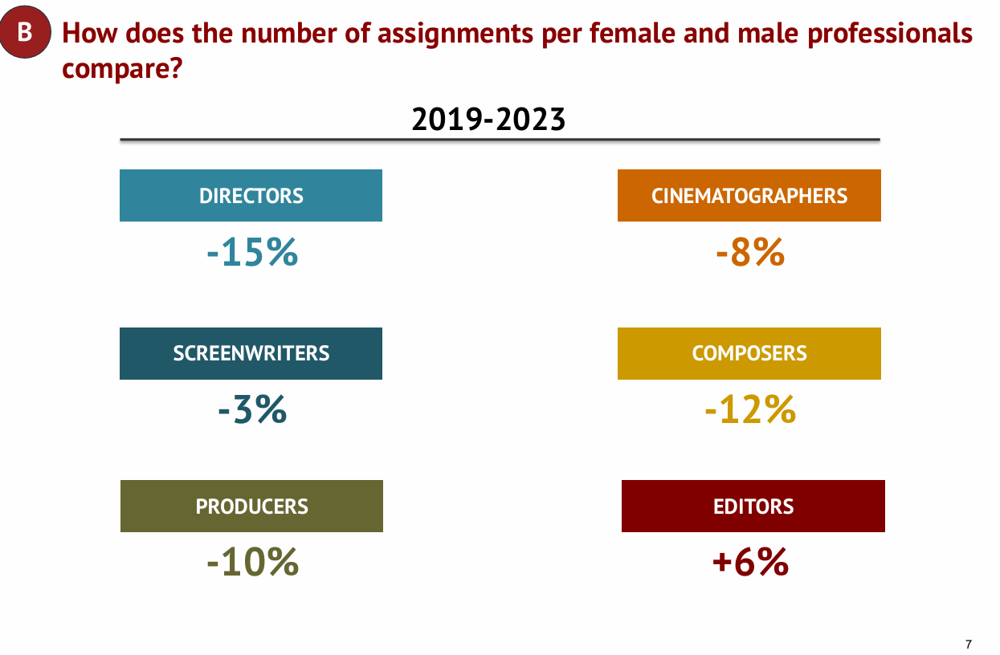

# Docling + FAISS + LangChain RAG

## Example
### Question Input:
How does the number of assignments per female and male professionals compare?
### Answer:
From the data provided, the number of assignments per female professional decreased in most categories from 2019-2023 compared to the previous period 2015-2018. Specifically, for directors, there was a decrease of 15%, screenwriters decreased by 3%, producers by 10%, cinematographers by 8%, composers by 12%. However, for editors, there was an increase of 6% in the number of assignments per female professional during 2019-2023.
### Resource in PDF:


## Reproduce
### env
```
    pip install docling
```
```
    pip install langchain faiss-cpu openai tiktoken
```
```
    pip install -U langchain-community langchain-openai 
```
### pdf to json/md file

```
python convert_with_docling.py
```
### json file to faiss

```
python rag_db_building.py
```

### q&a testing

```
python qa_exp.py
```
